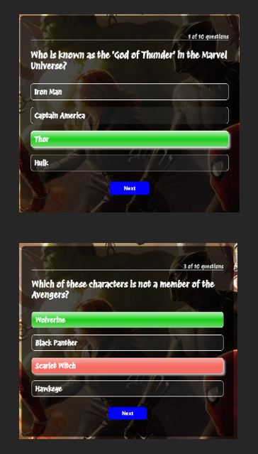
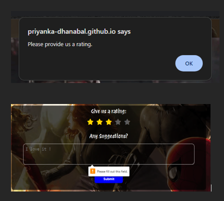
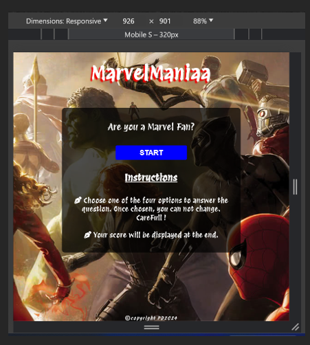
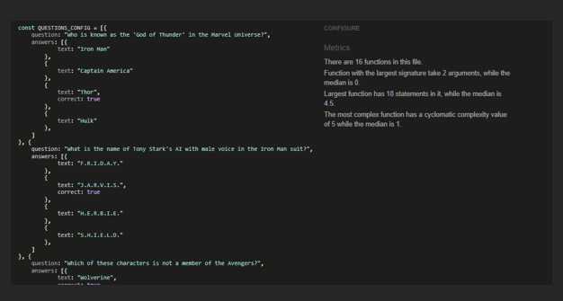

# MarvelManiaa

MarvelManiaa is a Marvel Studio-themed quiz website I decided to come up with as I love watching Marvel movies with my family and friends. The user will be provided with a question along with four options, among which one option will be the correct answer. The user will be able to view the result at the end of the Quiz.
### - By Priyanka Dhanabal
Live Website can be viewed [here](https://priyanka-dhanabal.github.io/MarvelManiaQuiz_PP2/)  
You can check out my Repository [here](https://github.com/Priyanka-Dhanabal/MarvelManiaQuiz_PP2)
## Table of contents
 1. [ UX ](#ux)
	- [Site Goal](#site-goal)
	- [User Stories](#user-stories)
	- [Design](#design)
	- [Wireframe](#wireframe)
 2. [ Features ](#features)
 3. [ Future Feature ](#future-features)
 4. [ Technology used ](#technologies-used)
 5. [ Testing ](#testing)
	 - [Manual Testing](#manual-testing)
	 - [Validations](#validations)
 6. [ Bugs ](#bugs)
 7. [ Deployment](#deployment)
 8. [ Citation of Sources](#credits)

## UX
### Site Goal

The goal of the site is to provide users with a bunch of questions and users will be able to view the score at the end of the quiz. The User will be able to provide feedback and a star review at the end as well.

The user will be provided with a question along with four options, among which one option will be the correct answer. When a user chooses the correct answer they can move on to the next question but if they choose a wrong answer, it will be highlighted with red and the correct answer will be shown.

### User Stories
#### As a User:
 - I want to play a Marvel-themed quiz.
 - I will be able to click one answer.
 - I will be able to view the right answer if a wrong answer is chosen.
 - I will be able to view the score once finished. 
 - I will be able to play again
#### As the site administrator:
 - I will be able to display the wrong answer and the right answer for the question.
 - I will be able to provide a score at the end of the quiz along with a gif to make the website more interactive.
 - I will be able to request feedback from the user and store it.
 - I will be able to provide a thank you message on the submission of the feedback form.

### Design
 - Colours:
	- **Text**: #fff
	- **Body Background**: Marvel Image taken from Google Images
	- **Container Background**: hsl(0deg 0% 0% / 70%)
- Typography:
	-  Imported **Protest Revolution** from Google font used as the primary font, and **Sans-Serif** used as the secondary font.

### Wireframe

## Features

 - Header

	 Featured at the top of the page, the header shows the Quiz name: MarvelManiA in a font that is visible and contrasts with the background.

	 
	 
 - Main

	- Welcome Container

		Consists of a Start Button to start the quiz and brief instructions to play the quiz.
		
		
		
	- Quiz Container

		Displays questions with 4 options. Once an option is chosen the right answer is highlighted with green and the wrong is with red. 
		On the top right-hand side, the user can view the question number.
		
		
		
		
		
	- Review Container

		A form requesting the user to provide a star rating and feedback.
		If the user does not wish to give a star rating, one first click on the submit button, and a window alert is given to provide a star rating. However, If the user still refuses, the star rating is taken as 1.
		
		
		
	- Score Container

		Displays the score obtained by the user along with a gif at the end of the quiz.
		
		
		
	- Home Button

		 Users can return to the welcome page.

		 
		 
 - Footer

     Display the copyright 
     
     

## Future-Features
- I would like to take the quiz to another level by adding a few more features like adding buttons at the welcome container where the user can choose which genre the quiz can be asked from.

- Add a few animations.

## Technologies Used

I have used the following technologies to build my website.

 1. **HTML** Used to structure my website
 2. **CSS** Used to style the content of my website to make it more appealing and user-friendly.
 3. **Javascript** Used to provide functionality to make my website interactive.
 4. **GitHub** Used to store my Project and later to deploy the same.
 5. **GitPod** Used as an Integrated Development Environment for building this website.
 6. **Git** Used to version control throughout my project and to ensure that a clean record is maintained.

## Testing
### Manual Testing
Below tests were carried out.
|Input  | Status |
|--|--|
|Users can view quiz content by clicking start  | True |
|Users can click the right answer and it displays green | True |
|Users can click on the wrong answer and it displays red along with the right answer | True |
|Users can not click any answer buttons once clicked  | True |
|Users can view the next question by clicking the Next button | True |
|Users can view the question number they are currently on  | True |
|Users can view the score with a gif  | True |
|Users can view the welcome page when the Home button is clicked  | True |

**Form Validation tests were carried out as below.**

|Input | Status |
|--|--|
|Users can give a star rating  | True |
|Users can give feedback | True |
|Users can not submit the form if the feedback text box is empty | True |
|Users receive a Windows alert if a star rating is not given | True |
|Users receive a response on form submission | True |

 **Page is responsive**
|Input | Status |
|--|--|
| Page is responsive to the device the user views the website | True |

### Validations

**HTML Validation** -W3C Validation 
- No error found

**CSS Validation** - using Jigsaw Validator 
- No error found

**Javascript Validation** - using JSHint Validator 
- No error or warnings found

### Google Lighthouse Testing

## Bugs

### Solved Bugs

- Initially, I developed a code where the new question's answer buttons would get appended and removed when a user moves to the next question.

- When the game is finished and the user comes back to the Home page, where the start button is displayed. If the user wanted to play again by clicking the start button, the score was displayed not the questions with options.

- I was advised by my mentor that the code works but it is not feasible, so I had to change my code in such a way that, there are no new buttons created but update the innerText value in the existing button.

- This resolved the Bug. Now the user can play continuously.

### unfixed Bugs

- no unfixed Bugs

## Deployment
How to deploy your project from Gitpod IDE to GitHub. I have used Gitpod as IDE for the project.

 1. Once all you're code is pushed to GitHub, by typing Git push in your IDE's Terminal window.
 2. Your GitHub Repository will have the latest code.
 3. From your project's repository navigate to settings.
 4. Within the Code and Automation section, select Pages.
 5. From the source section drop down select Deploy from a branch.
 6. From Branch select main and /(root) from the drop-down and click save.
 7. The page can be refreshed and the link will be shown on the same page.
 8. If the link has not appeared, navigate back to your project repository.
 9. On the right-hand side, select deployments, you will find the link here.
 
Live link of my website - https://priyanka-dhanabal.github.io/MarvelManiaQuiz_PP2/

## Credits
### Content and resources
1. Code Institute
	- Course content for the portfolio project2 helped greatly in understanding the need to complete the project.
	- The Love Math project helped me understand various requirements from HTML CSS and Javascript point of view.
2. W3 School
	- Used to reference Javascript and some CSS styling.
3. Favicons
	- Used to create an image to favicon.
4. Font Awesome
	- Library for ICONs used in my website.
5. Bro Code Youtube Channel
	- To learn Javascript and worked on some minor projects that were taught in that channel to understand the functions.
6. Images Used
	- The background image used was taken from Google Images.
7. Balsamiq
	- used to create a wireframe to illustrate my project idea.
8. ChatGPT
	- To generate 10 quiz questions.
9. StackEdit
    - To edit my readMe file content.

### Acknowledgements

Mentor - Akshat_Garg
- My Mentor provided feedback and guidance throughout.

Kristyna - Cohort facilitator
- She was very helpful in understanding the various requirements to achieve a good project.

Code Institute Tutor Support team
- The Tutor support team was always available to answer my questions. However, my usage of tutor support was minimal compared to the last time unit.

*****************

[Back to top](#marvelmaniaa) 